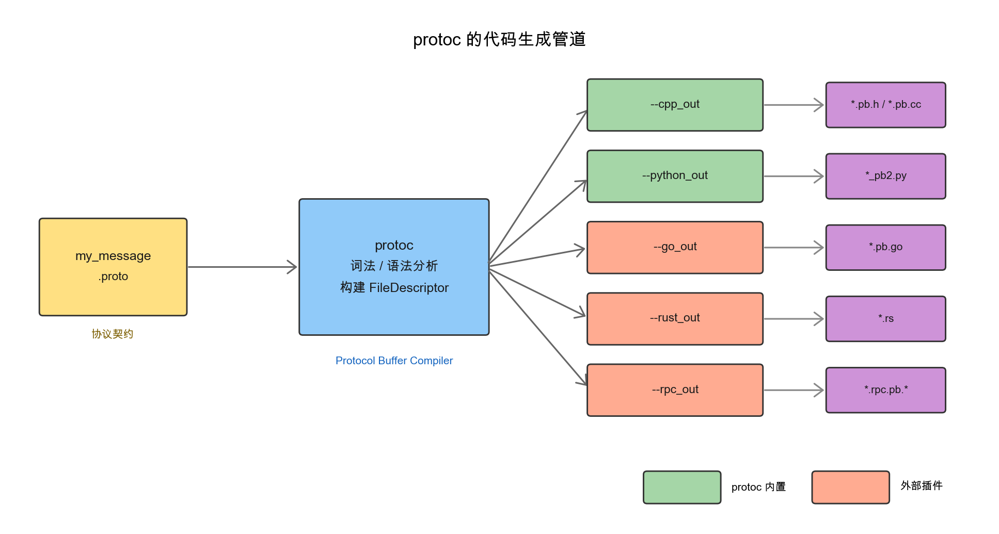
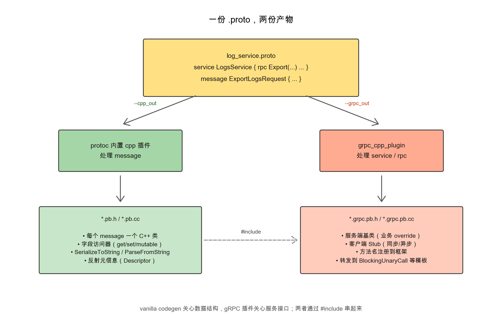
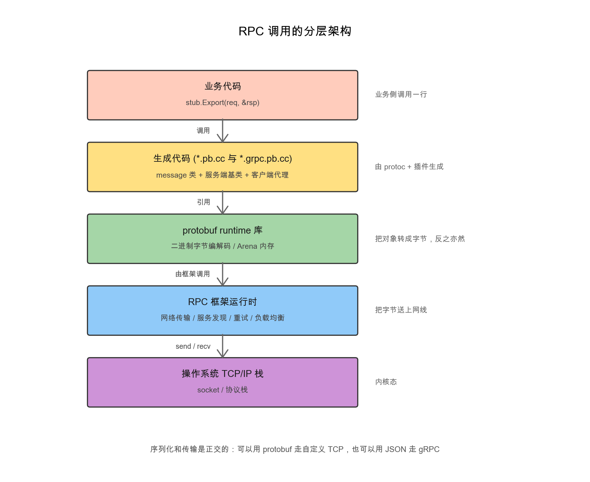

你有没有想过这样一件事：一个用Go写的客户端，发送一段数据到用C++写的服务端，对面收到的字段名、字段类型、字段语义居然能完全对得上？再进一步，几十个团队、几十种语言、几百个微服务彼此调来调去，怎么保证大家对"同一个接口"理解一致、不会因为某一方加了字段而把别人搞挂？

这背后是一整套支撑"跨语言通信"的工程机制。这篇文章先把这套机制抽象出来——它由"契约+代码生成+统一二进制规范"三件事构成；然后以protobuf + gRPC这一组合为例把每一块具体看一遍：protobuf负责契约和字节，gRPC负责把字节真正送过网络，二者一起构成当前最广泛使用、生态也最完整的一种实现。

## 跨语言通信的解题思路

不同语言之间共享数据时，有几个绕不开的问题：

- 内存布局各异。Go的struct不是Java的class，C++的string不是Python的str。要让两边读到同一份数据，必须有一种与语言无关的"中间表示"；
- 团队对接口的理解未必一致。字段叫什么、是不是必填、能不能为空、新增字段会不会让旧客户端崩溃，这些不在协议里写清楚就会出事；
- 协议要持续演进。线上服务一次次加字段、改语义，每次都要保证不撕裂上下游。

业界给出的标准解法可以拆成三件相互依赖的事：

1. 一份契约：用一种与语言无关的描述语言写下数据结构、服务接口、字段类型，作为多语言、多团队共享的字段语义来源——这种描述语言通常被称为IDL（Interface Definition Language，接口定义语言）；
2. 一个代码生成器：读取契约，自动生成各语言里可以直接`import`的桩代码（stub code），把契约翻译成本地的类、struct、函数签名；
3. 一套统一的二进制规范：保证各语言生成的桩代码序列化产物在字节层面一致，跨语言可以直接互读互写。

这三件事互相依赖——光有契约没有代码生成，每个团队都得自己手写解析器；光有代码生成而缺少统一二进制规范，各语言之间的字节互不识别。

业界沿着这条路走出来的具体实现不少，彼此之间的差异主要在两层：序列化协议负责"数据怎么变字节"，传输协议负责"字节怎么过网络"，两层是相互独立的——gRPC默认采用protobuf，但也可以挂JSON；protobuf也能走自研TCP协议而不上gRPC。序列化层从最熟悉的JSON / XML，到protobuf / Thrift / Avro这类"二进制+强schema"，再到FlatBuffers / Cap'n Proto这类零拷贝方案，构成一条从灵活、调试友好到字节紧凑、性能极致的连续光谱；传输层最常见的是HTTP（搭配JSON）和gRPC（搭配protobuf）。

protobuf在这条光谱上属于"二进制+强schema"的中间档；它的官方搭档是Google开源的gRPC，把序列化、传输、服务治理等环节整合成一套完整方案。protobuf + gRPC这一组合在大厂内部RPC里用得最多——不是字节最紧凑的，也不是最灵活的，但在生态成熟度、跨语言支持和可演进性上比较均衡。下面就以它为例，把这三件事每一块具体看一遍，先从IDL文件的形态开始。

## 一份IDL长什么样：以.proto为例

protobuf把它的IDL写在`.proto`文件里。一个最小的`.proto`包含这些元素：

```protobuf
syntax = "proto3";                   // 语法版本

package demo.attr;                   // 命名空间

option cc_enable_arenas = true;      // 给 C++ 代码生成器的提示
option go_package = "demo/attr";     // 给 Go 代码生成器的提示

import "google/protobuf/any.proto";  // 引用其他 proto

// 定义数据结构
message Item {
  int64  id     = 1;       // 字段三要素：类型 / 名字 / field_number
  string name   = 2;
  repeated string tags = 3;  // 列表
}

enum Color {
  UNKNOWN = 0;             // proto3 要求第一个枚举值必须是 0
  RED     = 1;
  BLUE    = 2;
}

// 定义 RPC 服务
service ItemService {
  rpc Get(GetRequest) returns (GetResponse);
}
```

每个元素的角色：

|关键字|作用|
|--------|------|
| `syntax` |声明使用proto2还是proto3语法|
| `package` |命名空间，避免不同`.proto`之间名字冲突|
| `option` |给代码生成器的指令，不影响线上字节|
| `import` |引用其他`.proto`文件中定义的类型|
| `message` |定义结构化数据，对应C++的struct或Java的class |
| `enum` |枚举类型|
| `service` + `rpc` |声明RPC服务及其方法签名|

字段三要素里值得单独提一下的是`field_number`，它是字段在线上字节流中的标识，字段名（`id`、`name`）只是给人看的、可以随时改名，但`field_number`一旦使用就不能改、不能复用，因为它直接决定了字节布局。这条性质后面讲跨语言通信兼容性时还会用到。

> service和rpc在某些项目里并不出现，因为这些项目只用protobuf做数据序列化、传输层走自己的协议，这种情况下`.proto`里只写message也能正常工作。其它IDL（如Thrift IDL、Cap'n Proto schema）整体形态非常类似——都包含命名空间声明、消息/结构体定义、服务接口声明这几块，只是关键字和语法略有差别。

## 代码生成的工作流

把IDL翻译成各语言可执行代码的工具，在protobuf这边叫`protoc`（Protocol Buffer Compiler），它是一个独立的可执行文件，只在build阶段运行。最常见的调用形式如下：

```bash
protoc -I=./proto \
       --cpp_out=./gen \
       --go_out=./gen \
       --python_out=./gen \
       my_message.proto
```

protoc自身内置了C++/Java/Python/Ruby/PHP/C#等几种语言；其它语言（Go、Rust、Dart）以及各类RPC框架（gRPC、Twirp、各家自研框架）通过外部插件接入。整体的代码生成管道是这样的：



每个`--xxx_out`命令行参数对应一个具体的codegen后端：内置的几种由protoc自身实现，外部插件则通过下面这个统一约定接入：

```text
protoc 看到 --foo_out=...
       ↓
就去 PATH 里找 protoc-gen-foo 可执行文件
       ↓
通过 stdin 把 FileDescriptorSet 喂给它
       ↓
插件通过 stdout 返回要生成的源文件列表
       ↓
protoc 把这些写到磁盘
```

通过这一插件机制，新语言或新框架可以独立扩展代码生成能力，不需要修改protoc自身。这种"驱动器+插件"的分工模式在Apache Thrift等其它IDL工具链里也很常见，是IDL类工具的一种典型架构。

## gRPC：把protobuf送上网络

上一节末尾把gRPC列在"通过外部插件接入的RPC框架"里——它对应的C++插件叫`grpc_cpp_plugin`。在展开它生成的桩代码之前，先认一下gRPC这个protobuf的官方搭档。

gRPC是Google开源、目前由CNCF托管的RPC框架，它的角色在分层架构里很明确：序列化用protobuf，框架自身负责服务发现、超时、重试、流控、拦截器、认证等通用机制。如果说protobuf回答的是"数据结构怎么变成字节"，gRPC回答的就是"字节怎么过网络"——它是这套主线里"跨语言通信"那一步真正的承担者。下面来看它给一个`service/rpc`声明生成的桩代码长什么样。

## 桩代码到底长什么样

接着用一个极简的"上报日志"服务做完整演示。同一份`.proto`在protoc链路里其实会跑两个插件：除了刚才提到的`grpc_cpp_plugin`处理`service/rpc`，`protoc`内置的cpp插件还会处理`message`，因此最终会得到消息层和服务层两份产物：



输入：

```protobuf
syntax = "proto3";
package demo.log.v1;

import "demo/log/v1/log_record.proto";

service LogsService {
  rpc Export(ExportLogsRequest) returns (ExportLogsResponse) {}
}

message ExportLogsRequest {
  repeated demo.log.v1.LogRecord records = 1;
}

message ExportLogsResponse {}
```

桩代码会被分成两层：消息层和服务层，分别由两个不同的插件生成。

先看消息层桩代码：vanilla `--cpp_out`生成的`*.pb.h`，负责数据结构与字节编解码。每个`message`翻成一个继承自`::google::protobuf::Message`的C++类：

```cpp
// 由 protocol buffer compiler 生成，不要手动编辑
namespace demo::log::v1 {

class ExportLogsRequest : public ::google::protobuf::Message {
 public:
  // 字段访问器（repeated 字段一组）
  int records_size() const;
  const ::demo::log::v1::LogRecord& records(int index) const;
  ::demo::log::v1::LogRecord* mutable_records(int index);
  ::demo::log::v1::LogRecord* add_records();

  // 序列化/反序列化（来自基类 Message）
  bool SerializeToString(std::string* output) const;
  bool ParseFromString(const std::string& data);

  // 反射元信息
  static const ::google::protobuf::Descriptor* descriptor();
};

}  // namespace demo::log::v1
```

这份产物里并不处理`LogsService`，它的职责局限在message层；`service`块在vanilla codegen看来只是注释。

再看服务层桩代码：gRPC的protoc插件（`grpc_cpp_plugin`）生成的`*.grpc.pb.h`，把`service/rpc`翻译成可用的客户端Stub和服务端基类：

```cpp
// 由 grpc_cpp_plugin 生成，不要手动编辑
#include "demo/log/v1/log_service.pb.h"  // 引用消息层桩代码

namespace demo::log::v1 {

class LogsService final {
 public:
  // 客户端：业务侧 new 一个 Stub 去调远程方法
  class Stub final {
   public:
    Stub(std::shared_ptr<::grpc::ChannelInterface> channel);

    // 同步调用
    ::grpc::Status Export(::grpc::ClientContext* context,
                          const ExportLogsRequest& request,
                          ExportLogsResponse* response);

    // 异步调用
    std::unique_ptr<::grpc::ClientAsyncResponseReader<ExportLogsResponse>>
    AsyncExport(::grpc::ClientContext* context,
                const ExportLogsRequest& request,
                ::grpc::CompletionQueue* cq);
  };
  static std::unique_ptr<Stub> NewStub(
      const std::shared_ptr<::grpc::ChannelInterface>& channel);

  // 服务端基类（业务侧 override 它来实现具体逻辑）
  class Service : public ::grpc::Service {
   public:
    Service();
    virtual ::grpc::Status Export(::grpc::ServerContext* context,
                                  const ExportLogsRequest* request,
                                  ExportLogsResponse* response);
  };
};

}  // namespace demo::log::v1
```

> 上面只是同步API那条线，gRPC还会同时生成callback API（基于回调）和较新的coroutine API（基于C++20协程）等若干变体，一行`rpc`在C++里通常会展开成6+个类。这就是契约带来的工程价值：你写一行schema，工具链负责给你铺好若干种调用形态的适配代码。

配套的`*.grpc.pb.cc`主要做两件事，一是把方法名注册到gRPC运行时，二是把客户端Stub的方法转发到gRPC内部的`BlockingUnaryCall`模板：

```cpp
namespace demo::log::v1 {

// 1. RPC 方法名表
static const char* LogsService_method_names[] = {
  "/demo.log.v1.LogsService/Export",
};

// 2. 服务端基类构造：把"方法名 → 处理函数"注册到 gRPC 运行时
LogsService::Service::Service() {
  AddMethod(new ::grpc::internal::RpcServiceMethod(
      LogsService_method_names[0],
      ::grpc::internal::RpcMethod::NORMAL_RPC,
      new ::grpc::internal::RpcMethodHandler<
          LogsService::Service, ExportLogsRequest, ExportLogsResponse>(
          [](LogsService::Service* svc, ::grpc::ServerContext* ctx,
             const ExportLogsRequest* req, ExportLogsResponse* resp) {
            return svc->Export(ctx, req, resp);
          }, this)));
}

// 3. 客户端 Stub：直接交给 gRPC 运行时去做实际的网络调用
::grpc::Status LogsService::Stub::Export(::grpc::ClientContext* context,
                                         const ExportLogsRequest& request,
                                         ExportLogsResponse* response) {
  return ::grpc::internal::BlockingUnaryCall<
      ExportLogsRequest, ExportLogsResponse>(
      channel_.get(), rpcmethod_Export_, context, request, response);
}

}  // namespace demo::log::v1
```

第3段尤其值得留意：客户端Stub的`Export`自身几乎不包含业务逻辑，它把请求和预先准备好的方法标识`rpcmethod_Export_`一起扔给`BlockingUnaryCall`模板，由gRPC运行时去做服务发现、序列化、网络发送、反序列化响应这一整套动作，桩代码这一层并不参与。

把这套机制摸顺之后，再看其它RPC框架的桩代码会发现结构高度相似——消息层做字段访问加序列化，服务层做方法签名映射加运行时转发，差别只在框架自身的命名约定和异步模型。

## 跨语言RPC的分层架构

把上面这一套补全成完整图景，从业务代码到操作系统，分层是这样的：



这张分层图里，gRPC占据了从服务层桩代码往下到传输层的几层——它把protobuf codec、网络传输、服务治理（拦截器、认证、超时）整合在一起；上面是业务自己的代码，下面是操作系统的socket。这套分层揭示出跨语言RPC能成立的几个支点：各语言生成的桩代码序列化输出在字节层面一致；字段名只是给人看的、机器只看field_number，因此重命名或新增字段不会撕裂上下游；RPC框架以全限定方法名做路由，与具体语言无关。三件事缺一不可，少一件就会让这套体系在某个点上漏风。

## 一句话总结

跨语言通信的标准解法是把"契约+代码生成+统一二进制规范"组装在一起：IDL沉淀字段语义，代码生成器把契约翻译成各语言的桩代码，运行时库负责把字节送上网线。protobuf + gRPC是这套思路下当前最完整的一种实现——前者解决数据怎么变字节，后者解决字节怎么过网络；掌握这一组合的内部结构之后，再看Thrift、Cap'n Proto等其他IDL体系或大厂的自研RPC框架，基本都可以快速类比。
