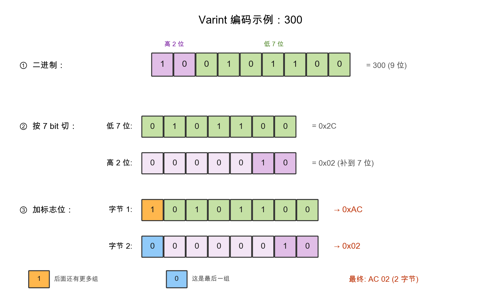
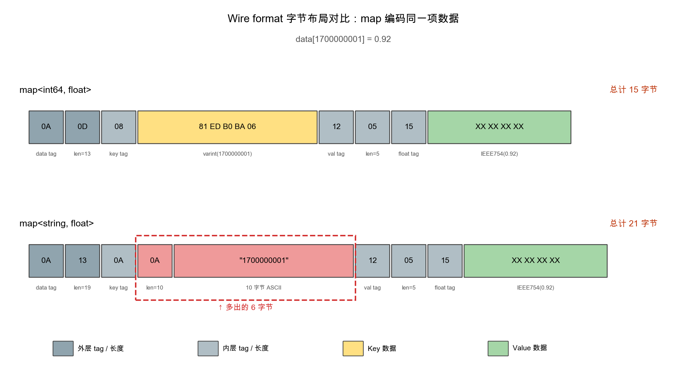
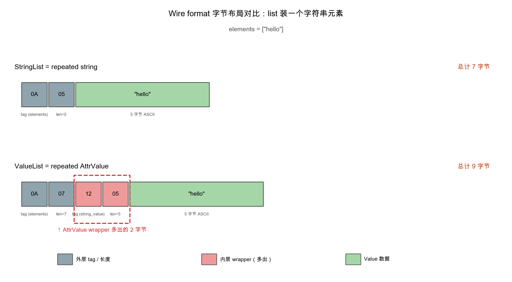
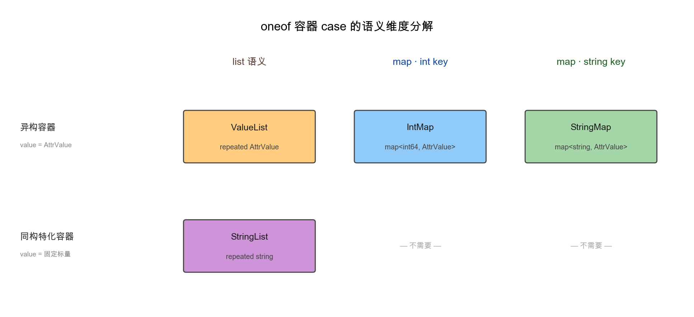
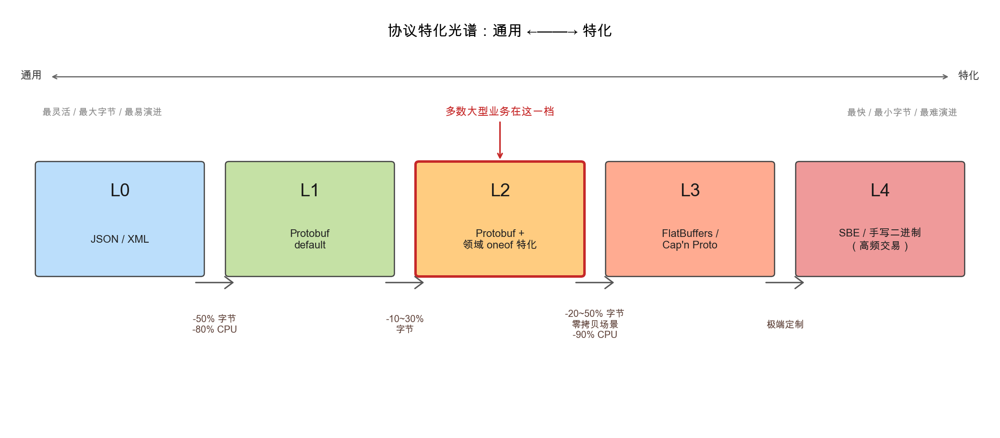

最近在和同事讨论一个内部RPC服务的协议设计，争论的焦点是一个看起来略有冗余的oneof类型。我当时有两个朴素的直觉判断：一是oneof里几个相近的容器case看起来可以合并掉一些，没必要写得这么细；二是oneof里塞这么多case，线上传输的字节开销大概会随case数线性上升。把这两件事想清楚的过程让我重新整理了一遍protobuf的设计逻辑：从wire format的字节布局，到数据结构层面的取舍。事后回头看，这两个直觉判断都不准确——这篇文章就从那个争论出发，沿着这条主线把protobuf的几层机制讲一遍，同时回答一个更大的问题：这套看起来颇为复杂的协议体系，为何成为大型分布式系统里被广泛采用的方案。

## 引子：一个oneof争论

在某个对外的通用数据协议里，团队定义了一个递归的"任意值"类型，用来承载各种异构属性：

```protobuf
message AttrValue {
  oneof Data {
    // 标量
    int64  int_value    = 1;
    string string_value = 2;

    // 容器
    StringList string_list      = 3;  // repeated string（同构）
    ValueList  value_list       = 4;  // repeated AttrValue（异构，可递归）
    StringMap  string_keyed_map = 5;  // map<string, AttrValue>
    IntMap     int_keyed_map    = 6;  // map<int64, AttrValue>
  }
}
```

3/4/5/6这4个容器case是争论的焦点。我看到这个oneof时有两个直觉反应：一是这4个容器有明显的可合并空间——`ValueList`和`StringMap`已经足够覆盖列表和map这两种基本语义，`IntMap`完全可以把int key写成string塞进`StringMap`，`StringList`也可以用`ValueList`装一堆字符串元素，留两个通用容器就够了；二是oneof里塞这么多case，线上一定会带来明显的字节开销——case越多、序列化出来的字节理应越大。同事则认为这4个case各自承担了不同的职责、不应当合并，并且oneof多case在线上其实并不付字节代价。我们意见相左的根源，其实是看待这个问题的层次不同——把字节布局和协议演进这两层弄清楚之后，多数判断会自然浮现。

要回答这两个直觉，需要先看一下protobuf的字节在线上是怎么排列的。

## Wire format：protobuf的字节布局

整套规则的核心其实只有两个公式加一种变长整数编码。

### TLV：每个字段都是一个小三元组

protobuf的二进制流就是一连串Tag-Length-Value的小段拼接：

```text
[ Tag ]  [ Value ]                   ← 简单类型（标量）
[ Tag ]  [ Length ]  [ Value ]       ← 复杂类型（变长）
```

- Tag：告诉接收方"我是哪个字段、值是什么形状"
- Length：仅对变长类型出现
- Value：实际数据

### Wire type：5种"形状"

接收方在不知道schema的情况下，至少需要能跳过自己不认识的字段。protobuf把所有数据类型按"如何读取"归并为五种wire type：

| wire_type |名字|怎么读|对应类型|
|-----------|------|--------|----------|
| `0` | VARINT |一个个字节读，最高位为0时停| int32/int64/uint64/bool/enum |
| `1` | FIXED64 |固定8字节| double, fixed64 |
| `2` | LENGTH_DELIMITED |先读长度，再读那么多字节| string、bytes、嵌套message、map |
| `5` | FIXED32 |固定4字节| float, fixed32 |

注意wire_type=2这一行：string、嵌套message、map在线上采用同一种编码方式，都是"先一个varint给长度、然后那么多字节"。至于这"那么多字节"内部是UTF-8文本还是嵌套message的递归字节流，由接收方依据schema解释，wire format这一层不区分。

### Tag的公式

```text
tag = (field_number << 3) | wire_type
```

左移3位是为了把低3位让给wire_type（最大值5，3 bit够），算出的tag数字本身再用varint编码写入字节流。由此可以推出一条与协议设计有关的性质：当field_number ≤ 15时tag占1字节，16~2047时tag占2字节，所以`.proto`里编号小的位置是稀缺资源，高频字段通常会被有意识地分配到前15个编号。

### Varint：变长整数编码

varint的思路是小数字用少字节、大数字才用多字节。编码规则：把数字按每7 bit一组切开，从低位往高位排列；每组前面加一个标志位，后面还有更多组就是1，最后一组是0。以编码`300`为例：



整个过程分三步：先把`300`的二进制`100101100`按低位优先切成`0101100`（低7位）和`0000010`（高位补到7位）两组；再分别在前面加上标志位1（"后面还有"）和0（"这是最后一组"），得到两个完整字节`0xAC`和`0x02`。

对于一个10位时间戳（约17亿），varint占5字节，而同样的数字若用字符串表达需要10字节，这个差额是protobuf紧凑性的主要来源之一。

### 一个完整的字节布局示例

把上面的规则合起来用一次。假设有一条`map<int64, float> data = 1;`，存一项`data[1700000001] = 0.92`，看它的完整字节布局。

map在protobuf里是一种语法糖，编译器会把它展开为：

```protobuf
message MapEntry {
  int64 key   = 1;
  float value = 2;
}
repeated MapEntry data = 1;
```

也就是说，每个map entry是一个length-delimited的子message。把这条规则套到`data[1700000001] = 0.92`这一项上，可以画出完整的字节布局——同时把key类型从`int64`换成`string`、值是`"1700000001"`的版本一并画出做对照：



上面板是15字节，下面板是21字节，差额6字节全部出现在key这一段——int64的varint表达只占5字节、且不需要额外的length前缀，而10字符的字符串则要先来个长度字节、再放10字节的ASCII内容；这个差额是按规范逐字节推算得出的，并非估算。

再看一个list的例子。同样存一个字符串元素`"hello"`，对比同构容器`StringList`（`repeated string`）和异构容器`ValueList`（`repeated AttrValue`，即套一层`AttrValue` wrapper）：



`StringList`总共7字节，`ValueList`总共9字节——多出的2字节是`AttrValue` wrapper的内层tag + length（图里红框部分）。每多一个元素就多付一次wrapper开销，一个有几十上百个元素的字符串列表，叠加下来就是几百字节的差距。

### oneof在wire上的字节代价

把上面这套字节规则套到引子的oneof上，可以顺手解决其中一个直觉。oneof在wire format上没有自己的标签，它只是schema层面的互斥约束；序列化时只对那个被赋值的case进行编码，其它case不出现在字节流里。

```protobuf
message AttrValue {
  oneof Data {
    int64  int_value     = 1;
    float  float_value   = 2;
    string string_value  = 3;
    // ... 即便有 100 个 case
  }
}
```

如果实际只用`int_value = 42`，线上就两个字节：tag(0x08) + varint(42)，剩下的99个case一字节都不占。

由此可以得到一个稍反直觉的结论：oneof的case数量本身不会让数据变大，只要所有case的field_number都≤ 15（tag仍然1字节），扩展oneof在字节层面几乎没有代价。这正好打消了我在引子里的第二个直觉——多塞case并不会让传输成本随之上升，因为没被赋值的case在线上根本不存在。

> 这条性质对协议设计的影响不小：在wire format层面"为完备性多预留几个oneof case"几乎不付出字节成本，代价主要落在编译产物层面——生成的代码多几个分支函数，CPU缓存压力略有增加，但相比网络字节的节省在数量级上要小不少。

## 从wire format反推数据结构设计

字节规则讲清楚之后，引子里的第二个直觉就已经站不住脚了——多塞case在线上不付字节代价。剩下要回答的是第一个直觉：`IntMap`和`StringList`真的是可以被`StringMap`和`ValueList`模拟掉的"冗余特化"吗？把4个容器case按设计维度拆开看，可以画成下面这张图：



横轴是容器类型，纵轴是值类型的特化程度。`IntMap`和`StringList`相对`StringMap`/`ValueList`各自多走一步特化——这两步特化在线上同时换来"省空间"和"省时间"两份收益，下面分别看。

### 角度一：节省空间

`IntMap`单独保留的字节经济从wire format直接读出来。当key是数值时（如ID、timestamp），int64通过varint只占5~6字节，对应的字符串表达则要逐字节存ASCII：

| key表达方式| wire字节数|差额|
|--------------|-------------|------|
| `int64 key = 1700000001`（varint）| 6 B | — |
| `string key = "1700000001"`（10字符）| 12 B | +6 B |

`StringList`的字节经济也已经在前面list字节布局示例里给过：每个string元素，`StringList`比`ValueList`少2字节的`AttrValue` wrapper。

把这些差额放大到一个比较常见的中等规模：一个响应里有10个这样的map、每个平均30个entry，那么全用string key比int64 key多10 × 30 × 6 ≈ 1.8 KB。一个5万QPS的服务在这个差额下：

```text
1.8 KB × 50,000 ≈ 90 MB/s 多余带宽
                ≈ 7.6 TB/天
                ≈ ~228 TB/月
```

90 MB/s在单台25 Gbps网卡（实际可用约2 GB/s）上要吃掉4~5%的容量，对一个用十几台机器扛流量的服务来说，相当于多吃掉半台机器的接入能力；再考虑到一次请求通常会经过四到五层中间件、每一跳都重复一次序列化反序列化，逐跳叠加之后的总体开销会显著高于单点数字。更关键的是，这部分代价不是一次性的——协议一旦上线就很难推倒重来，每一份多出来的字节都会在协议剩下的整个生命周期里持续兑现，按几年算累计下来不是一个可以忽略的量。这正是设计者愿意为`IntMap`和`StringList`各留一个case的原因：单条只多几个字节看起来不大，但一旦放到"高QPS ×长生命周期×逐跳放大"这个乘法里，就成了值得专门优化的尺寸。

### 角度二：节省时间

字节差异之外，`IntMap`和`StringList`还各自带来CPU侧的明显收益，主要体现在反序列化和访问两个环节：

- `IntMap`的整数key：hash和比较都在常数时间内完成（一条CPU指令就能算出整数hash、一条比较指令判等）；`StringMap`的string key则要做O(N)的hash和`memcmp`，每次map访问都得为这次比较付额外开销，差距通常在3~5倍。如果调用方还要按key做查找、聚合、排序，差距会被进一步放大。
- `StringList`的同构元素：反序列化时直接从字节流里读出连续的string数据；`ValueList`每个元素都要先解一层`AttrValue`嵌套message、再拿到内部的`string_value`——多一次length-delimited解析、多一次内存分配，对一个有几百个元素的列表来说，反序列化耗时会差出不止一倍。

可以看到，`IntMap`和`StringList`这两步特化在两个维度上对称地各贡献一份——空间上分别省6字节/key和2字节/元素，时间上分别省一次string hash和一次嵌套message解析。如果把它们合并到`StringMap`和`ValueList`，相当于把这两个维度的收益同时让出去，在字节和CPU两方面都退一步。

## 跳出来看：工业界的特化光谱

把这个oneof设计放到行业语境里看，"减少协议通用性、换取性能"的特化做法在大型系统里相对常见。把它放在一个光谱上看：



档位之间标注的是切换到下一档大致能拿到的字节或CPU收益增量；越往右越特化、字节越省、性能越高，但对应的代价是协议的灵活性和可演进性也在变差。多数大型公司的核心高QPS服务（推荐、特征、广告、消息流）落在L2这一档——既保留protobuf本身的可演进性，又通过领域oneof拿到30~50%的字节收益，引子里争论的那个oneof设计就属于这一档的典型。

判断协议是否值得做这种特化，常用的几条经验：

- QPS ×单条payload越大越值得（量级≥ 1 GB/s是经典的甜蜜点）
- 协议预期生命周期较长（≥ 2年）
- 调用方多但都在公司内（schema演进可控）
- 数据结构有可识别的正交维度（list vs map、int vs string key），而不只是凑数

## 回到那个oneof争论

带着前面这些讨论再看开头的两个直觉判断，结论已经比较清楚。第二个判断——"oneof多case会让传输成本随之上升"——在wire format那一节就已经被推翻：oneof在线上没有专属字节代价，只编码被赋值的那个case，其它case完全不出现在字节流里。第一个判断——"`IntMap`和`StringList`是可合并的冗余特化"——在"省空间"和"省时间"两个角度里同时被推翻：`IntMap`让数值key走varint而非ASCII，单条节省6字节，map访问还能用更快的整数hash；`StringList`让字符串元素直接就是string，省掉每个元素一层`AttrValue` wrapper和一次嵌套message解析。两个case在两个维度上对称地各拿一份收益。

把这两件事并起来看，结论就反过来了：保留多个case在传输层面几乎不增加成本，反而能精确表达业务结构里的正交维度；而对外协议中oneof字段一旦发布，删除属于破坏性变更，不可逆。所以"够用就好"在协议设计里其实是个误判——协议是契约，一旦上线就很难修改，更稳妥的做法是在协议层把可识别的正交维度都明确表达出来，而不是事后再补。

## 一句话总结

protobuf的序列化设计哲学其实围绕一个朴素的逻辑：字节布局、语义表达、可演进性这三件事彼此绑定。把wire format弄清楚之后，每一个field_number的选择、每一个oneof的边界、每一个map key的类型都会成为带有可量化代价的工程决策；而当你写下一个`int64 id = 1`时，那个`1`在协议生命周期里几乎不可撤销，这件事值得提前知道。
