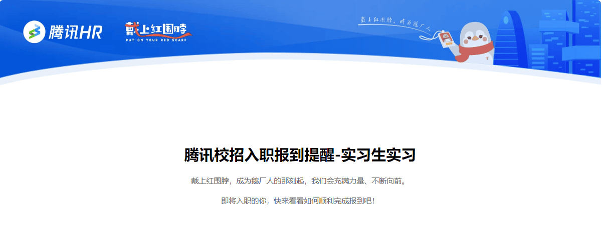

刚刚收到了腾讯的入职报到提醒，想着趁热打铁总结一下这一个月的投递情况。

我个人的准备时间只有断续三个多月。循规蹈矩地力扣刷200多题、b站学java项目、牛客和java guide背面经，加上中途的考试、过年、军训（大三军训），已经耗费了我大部分精力。老实说我的竞争力并不强，加上只考虑本地的实习，因此被大厂挂了个遍，中厂能收到面试的也寥寥无几。兜兜转转，最后还是第一家投递的腾讯收留了我。

一路准备下来，算法、项目和八股除了帮助我收获offer以外，更让我对技术祛魅了。回想刚进大学的时候，那会总觉得进大厂工作是朦朦胧胧的梦，也怀疑自己是否真有能力学会这么复杂的技术栈。但几个月的学习，让我慢慢除去了滤镜，对大厂需要什么样的校招生、自己能成为什么层次的校招生有了明确的认知：能面试手撕经典算法、能掌握专业课基础、能备好常见技术栈知识点，加上一个不错的学历，已然足够。当然，这也让我认清自己和真正大佬的差距，引擎、数据库等等硬核岗位我是想都不敢想了。

想来自己真的很幸运，当初决定做后端是出于认为后端是业务核心、竞争力强，但这个岗位厮杀之激烈却是远超我的想象。大厂简历挂、中厂进度慢、小厂实习时长要求高，让我一度想放弃。一个月的投递时间里，我只面试了五场，但正式投递的公司有超过三十家，boss直聘上也发了上百个询问。进度推进缓慢的日子相当折磨，学长一句“守得云开见月明”的鼓励让我一路坚持投递、测评、笔试，直到oc为止。最后虽然收到了offer，但岗位从java变成了c++，技术栈得从头开始学，简历项目估计也要重写，面对的挑战还很多……突然想起，用java的大厂是美团和阿里，但这两家在深圳都没什么hc，也算是我的决策失误了。

投递情况：

* oc的有：腾讯pcg 
* 拒面试的有：虾皮、美的 
* 面试挂的有：阿里蚂蚁 
* 简历挂的有：oppo、元象科技、阿里智能信息、阿里云、阿里国际、快手、美团、字节 
* 泡池子的太多，不一而足

* 最后附上我的[24暑期实习投递记录](https://docs.qq.com/sheet/DQ3BuU3VsSGNoWUJz?u=ad0f465ca5b74db2ae91d2782e87cd7b&tab=BB08J2)供参考。